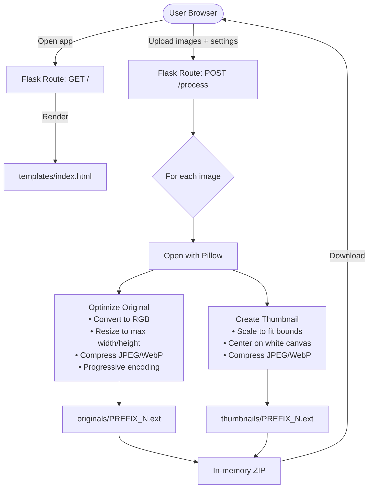

# PicPrep — Architecture

A minimal local web app for batch-processing gallery images before uploading them to a cPanel-hosted website.

---

## How It Works



---

## Component Overview

```
image-editor/
├── app.py            # Flask app — routes + image processing logic
├── config.py         # Defaults: thumbnail size, quality, prefixes, max dimensions
├── requirements.txt  # Flask, Pillow
├── templates/
│   └── index.html    # Single-page UI (drag & drop, file list, settings form)
└── venv/             # Python virtual environment (not committed)
```

---

## Data Flow

| Step | Detail |
|------|--------|
| **1. Select images** | User drags & drops or picks files. A JS-managed list allows individual removal. |
| **2. Configure** | Set prefix (original & thumbnail separately), start number, thumbnail dimensions, output quality (separate for original & thumb), max original width, format (JPEG or WebP). |
| **3. Submit** | Browser sends a `multipart/form-data` POST via `fetch`. No page navigation. |
| **4. Process** | Flask reads each image with Pillow in memory — no temp files written to disk. |
| **5. Originals** | Resized to fit within `Max Width × Max Height`, compressed with chosen quality and format. Produces progressive JPEG or WebP. |
| **6. Thumbnails** | Scaled to fit inside the thumbnail box, centered on a white background canvas. No cropping, no distortion. |
| **7. Naming** | Files named `{prefix}{N}.ext`. Prefix can be empty (number only). Originals and thumbnails have independent prefixes. Numbering starts from user-defined value with no zero-padding. |
| **8. Download** | All processed files returned as a single ZIP with `originals/` and `thumbnails/` folders. |

---

## Configuration Defaults (`config.py`)

| Setting | Default | Description |
|---------|---------|-------------|
| `THUMBNAIL_WIDTH` | 360 | Thumbnail canvas width in pixels |
| `THUMBNAIL_HEIGHT` | 360 | Thumbnail canvas height in pixels |
| `ORIGINAL_QUALITY` | 75 | JPEG/WebP quality for originals |
| `THUMBNAIL_QUALITY` | 80 | JPEG/WebP quality for thumbnails |
| `MAX_ORIGINAL_WIDTH` | 1200 | Max resize dimension for originals |
| `MAX_ORIGINAL_HEIGHT` | 1200 | Max resize dimension for originals |
| `ORIGINAL_PREFIX` | `""` | Prefix for original filenames (empty = number only) |
| `THUMBNAIL_PREFIX` | `"work-"` | Prefix for thumbnail filenames |
| `OUTPUT_FORMAT` | `jpg` | Output format: `jpg` or `webp` |
| `BACKGROUND_COLOR` | `(255,255,255)` | Thumbnail fill color (white) |

---

## Running Locally

```bash
# Activate virtual environment
source venv/bin/activate

# Start dev server
python app.py
# → http://localhost:5000
```
