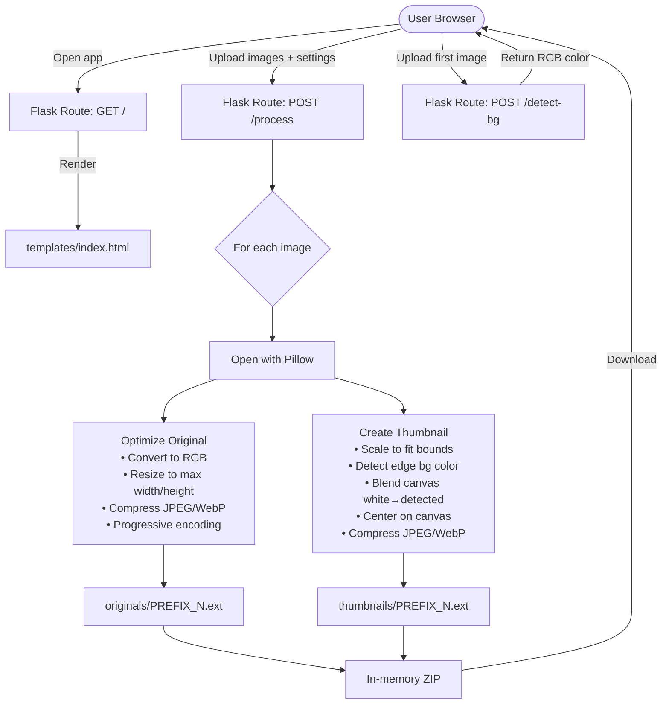

# PicPrep

A minimal local web app for batch-processing gallery images before uploading them to a cPanel-hosted website. Upload images, configure output settings, and download a ZIP containing resized originals and thumbnails.

## Features

- Batch process multiple images at once
- Generate web-optimized originals (resized + compressed)
- Generate centered thumbnails on a solid background (no cropping, no distortion)
- Background Match slider — blends thumbnail canvas from pure white toward the detected image background color
- Output as JPEG or WebP
- Independent prefix and quality settings for originals vs thumbnails
- All processing done in memory — no temp files written to disk
- Single ZIP download with `originals/` and `thumbnails/` folders

## Setup

```bash
python -m venv venv
source venv/bin/activate
pip install -r requirements.txt
```

## Usage

```bash
source venv/bin/activate
python app.py
# → http://localhost:5000
```

1. Drag & drop or select images
2. Configure prefix, start number, dimensions, quality, and format
3. Click **Process** — the ZIP downloads automatically

## Project Structure

```
picprep/
├── app.py            # Flask app — routes + image processing logic
├── config.py         # Defaults: thumbnail size, quality, prefixes, max dimensions
├── requirements.txt  # Flask, Pillow
├── templates/
│   └── index.html    # Single-page UI (drag & drop, file list, settings form)
└── venv/             # Python virtual environment (not committed)
```

## Architecture



### Data Flow

| Step | Detail |
|------|--------|
| **1. Select images** | User drags & drops or picks files. A JS-managed list allows individual removal. |
| **2. Configure** | Set prefix (original & thumbnail separately), start number, thumbnail dimensions, output quality, max original width, format (JPEG or WebP), and background match level. |
| **3. Submit** | Browser sends a `multipart/form-data` POST via `fetch`. No page navigation. |
| **4. Process** | Flask reads each image with Pillow in memory — no temp files written to disk. |
| **5. Originals** | Resized to fit within `Max Width × Max Height`, compressed with chosen quality and format. Produces progressive JPEG or WebP. |
| **6. Thumbnails** | Scaled to fit inside the thumbnail box, centered on a background canvas. The Background Match slider (0–100%) blends color from pure white toward the detected image edge color, giving a subtle tint that matches the original. Default: 5%. No cropping, no distortion. |
| **7. Naming** | Files named `{prefix}{N}.ext`. Prefix can be empty (number only). Originals and thumbnails have independent prefixes. Numbering starts from user-defined value. |
| **8. Download** | All processed files returned as a single ZIP with `originals/` and `thumbnails/` folders. |

## Configuration Defaults

| Setting | Default | Description |
|---------|---------|-------------|
| `THUMBNAIL_WIDTH` | 360 | Thumbnail canvas width (px) |
| `THUMBNAIL_HEIGHT` | 360 | Thumbnail canvas height (px) |
| `ORIGINAL_QUALITY` | 75 | JPEG/WebP quality for originals |
| `THUMBNAIL_QUALITY` | 80 | JPEG/WebP quality for thumbnails |
| `MAX_ORIGINAL_WIDTH` | 1200 | Max resize width for originals |
| `MAX_ORIGINAL_HEIGHT` | 1200 | Max resize height for originals |
| `ORIGINAL_PREFIX` | `""` | Prefix for original filenames |
| `THUMBNAIL_PREFIX` | `"work-"` | Prefix for thumbnail filenames |
| `OUTPUT_FORMAT` | `jpg` | Output format: `jpg` or `webp` |
| `BACKGROUND_COLOR` | `(255,255,255)` | Base thumbnail background fill (white) |
| `BG_BLEND_DEFAULT` | `5` | Default Background Match slider value (0–100%) |

## Dependencies

- [Flask](https://flask.palletsprojects.com/) 3.1.0
- [Pillow](https://python-pillow.org/) 11.1.0
